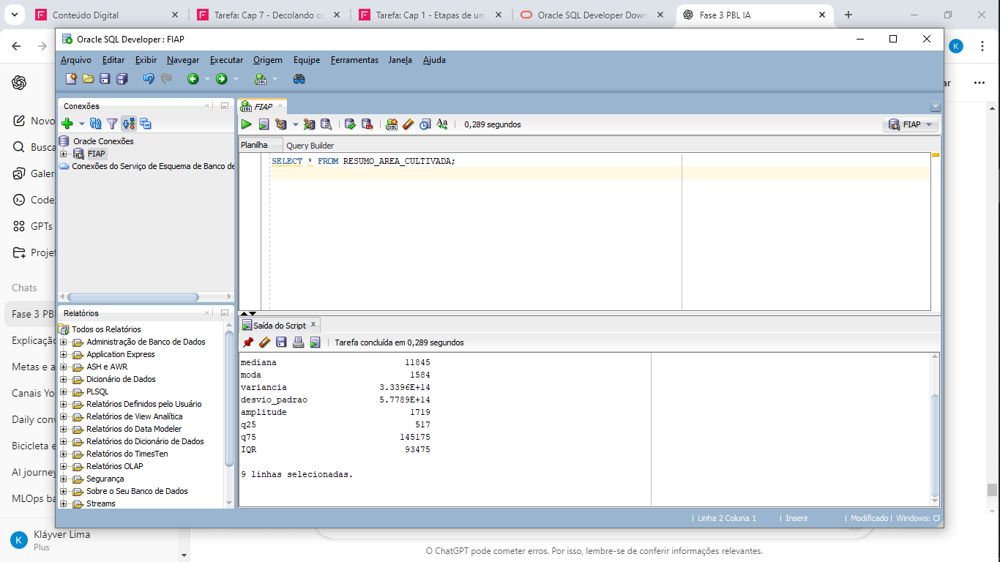

# FarmTechSolutions_Fase3_PBL
# 🌾 FarmTech Solutions – PBL Fase 3  
### FIAP – Curso de Inteligência Artificial  
**Aluno:** Kláyver Lima – RM566837  
**Startup:** FarmTech Solutions  
**Tema:** Integração de dados de sensores agrícolas com Banco de Dados Oracle  

---

## 🧠 Introdução
O PBL (Project-Based Learning) do curso de Inteligência Artificial é uma jornada que simula o crescimento de uma startup.  
Neste caso, a **FarmTech Solutions** atua (de forma fictícia) como uma **consultoria em soluções de Inteligência Artificial para o agronegócio**, um dos setores mais promissores para aplicação de IA no Brasil, segundo o *Global AI Jobs Barometer da PwC (2025)*.

Na **Fase 3**, o objetivo é conectar os dados coletados na **Fase 2** (sensores agrícolas) a um **banco de dados relacional Oracle**, utilizando o **Oracle SQL Developer** para armazenamento e consultas SQL.

---

## 🎯 Objetivo da Atividade
Demonstrar a criação de uma tabela no banco de dados Oracle, importando um arquivo CSV com dados gerados pelos sensores (Fase 2) e realizando consultas SQL para verificar a importação e manipular os dados.

---

## 🧩 Tecnologias Utilizadas
- **Oracle SQL Developer**  
- **Banco de Dados Oracle (oracle.fiap.com.br)**  
- **Arquivo CSV da Fase 2:** `resumo_area_cultivada.csv`  
- **Linguagens utilizadas na coleta:** R / Python  
- **GitHub** (para versionamento e documentação)  

---

## ⚙️ Passo a Passo

### 1️⃣ Conexão com o Banco de Dados
Configuração da conexão no Oracle SQL Developer:

| Campo | Valor |
|-------|-------|
| **Nome da Conexão** | FIAP |
| **Usuário** | RM566837 |
| **Senha** | Data de nascimento (DDMMYY) |
| **Host** | oracle.fiap.com.br |
| **Porta** | 1521 |
| **SID** | ORCL |

---

### 2️⃣ Importação dos Dados
O arquivo `resumo_area_cultivada.csv` (gerado na Fase 2) foi importado para o Oracle SQL Developer, criando a tabela `RESUMO_AREA_CULTIVADA`.  

📸 **Figura 1 – Importação dos dados no Oracle SQL Developer**  
Etapa do processo de importação mostrando o nome da tabela e as colunas detectadas a partir do arquivo CSV.


---

### 3️⃣ Consulta SQL
Após a importação, foi realizada a consulta SQL abaixo para visualizar os dados carregados:

```sql
SELECT * FROM RESUMO_AREA_CULTIVADA;
```markdown

